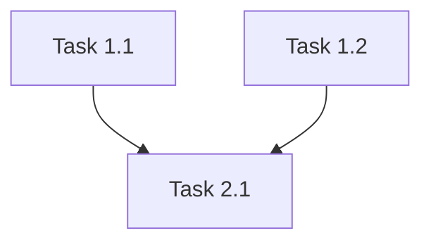

# Plan Tasks

Create an implementation task plan with status tracking and dependency graph from a design document.

## Mode

- **interactive** (default): Full standalone workflow. Reads from `docs/designs/`, saves to `docs/specs/In-Progress/{feature-name}-tasks.md`.
- **spec**: Called by `create-spec`. Reads the full unified spec, produces the `## 4. Task Plan` section.

## Process

### Phase 1: Read the Design

1. Read the design document.
2. Identify modules/components to implement, dependencies between them, and file structure.

### Phase 2: Define Tasks

Break implementation into tasks following these principles:
- **One to two files per task** — keeps reviews manageable
- **Infrastructure first** — Terraform/Kubernetes before application code
- **Bottom-up order** — implement dependencies before dependents
- **Tests with implementation** — each task includes tests

For each task, define:
- **Task number** — hierarchical (1.1, 1.2, 2.1) grouped by layer/phase
- **Description** — brief summary
- **Objective** — what this task accomplishes
- **Files** — the files to create/modify (1-2 max)
- **Instructions** — specific implementation details
- **Definition of Done** — how to verify (tests pass, endpoint responds, kubectl shows running)
- **Estimated effort** — Small / Medium / Large

### Phase 3: Build Dependency Graph

- Determine prerequisites for each task
- Identify parallel tracks (tasks with no dependencies between them)
- Group into execution waves

### Phase 4: Write Plan

```markdown
# Task Plan: {Feature Name}

## Progress Summary
- Total Tasks: X
- Completed: 0
- In Progress: 0
- Not Started: X

## Task Status

| Task | Description | Prerequisites | Status |
|------|-------------|---------------|--------|
| 1.1  | Description | None          | [ ]    |

## Eligible Tasks
Tasks ready to start (prerequisites complete):
- **1.1** — Description

## Dependency Graph



## Detailed Task Definitions

### Task 1.1: {Title}
**Objective**: What this accomplishes.
**Files**: `applications/insurance-claims-processing/src/file.py` or `infrastructure/terraform/resource.tf`
**Prerequisites**: None
**Instructions**:
- Step by step implementation details
**Definition of Done**:
- Tests pass
- Specific verification criteria
**Effort**: Small
```

5. Present the plan to the user for review before saving.

## Rules

- Tasks must be completable in a single context window — if in doubt, split.
- Every task must have a verifiable Definition of Done.
- Terraform/Kubernetes tasks come before application code tasks.
- Refer to the user as "The Team".
