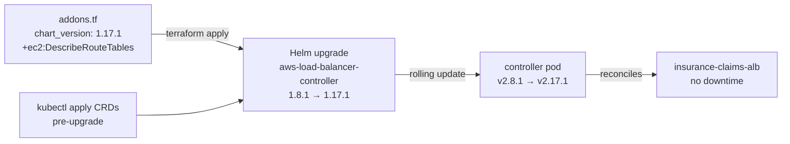
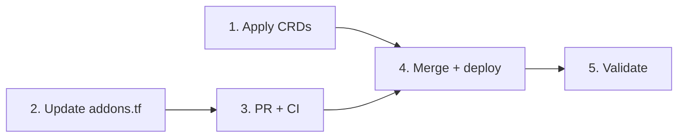

# Specification: Upgrade aws-load-balancer-controller (Issue #18)

**Issue:** [#18](https://github.com/khodo-lab/sample-agentic-insurance-claims-processing-fargate/issues/18)  
**Branch:** `feature/issue-18-alb-controller-upgrade`  
**Status:** In Progress — All phases complete, ready for implementation

---

## 0. Research Findings

### Actual Scope (audited from codebase)

- **File:** `infrastructure/terraform/addons.tf`, lines 124–155
- **Module:** `aws-ia/eks-blueprints-addons/aws` version `~> 1.20`
- **Current config:** `chart_version = "1.8.1"`, image `public.ecr.aws/eks/aws-load-balancer-controller:v2.8.1`
- **EKS cluster:** `agentic-eks-cluster`, Kubernetes 1.33, us-west-2
- **Active ingress:** `insurance-claims-ingress` in namespace `insurance-claims`, serving 4 portals via ALB `insurance-claims-alb`
- **Inspector finding:** OS CVEs in v2.8.1 image, severity Info, status Assigned, owner hodok

### Version Landscape (verified April 2026)

| Version | Helm Chart | Released | Notes |
|---------|-----------|----------|-------|
| v2.8.1 | 1.8.1 | ~mid-2024 | **Current — has OS CVEs** |
| v2.17.1 | 1.17.1 | Jan 2026 | Last v2.x release, patched OS packages |
| v3.0.0 | 3.0.0 | Jan 2026 | Major version — chart version now = controller version |
| v3.2.2 | 3.2.2 | Apr 18, 2026 | **Latest stable** |

**Key fact:** Starting v3.0.0, Helm chart version = controller version (e.g., chart 3.2.2 = controller v3.2.2). Before v3.0.0, chart 1.x.x = controller v2.x.x.

### Recommended Approach

**Upgrade to v2.17.1 (Helm chart 1.17.1)** — the last v2.x release. This is the surgical choice:
- Stays within the v2.x line (no major version risk)
- Patched OS packages resolve the Inspector finding
- No breaking changes to existing Ingress annotations
- No CRD schema changes that require manual pre-apply
- Single-line change to `chart_version` in `addons.tf`

**Why not v3.x?** v3.0.0 introduced Gateway API GA and Helm chart version alignment. While v3.x is backward-compatible for Ingress users, it requires CRD updates (`kubectl apply -k`) and the eks-blueprints-addons module (~> 1.20) may not have been tested against chart 3.x. The v2→v3 jump is a larger change than needed to resolve an OS CVE. Defer to the CDK migration (#2) which will replace this stack entirely.

### Alternatives Considered

| Option | Verdict | Reason |
|--------|---------|--------|
| Bump `chart_version` to `1.17.1` (v2.17.1) | ✅ **Recommended** | Surgical, no breaking changes, resolves CVE |
| Bump to `3.2.2` (v3.x latest) | ⚠️ Defer | Major version, CRD updates required, module compatibility unknown |
| Pin image tag only (`image.tag = "v2.17.1"`) | ❌ Avoid | Version mismatch between chart and image; doesn't update CRDs or chart manifests |
| Do nothing | ❌ | Inspector finding persists; OS CVEs in a controller with broad IAM permissions |

### Edge Cases & Gotchas

- **IAM policy drift (highest risk):** The eks-blueprints-addons module embeds the LBC IAM policy at module install time. Bumping only `chart_version` does NOT update the IRSA policy. Between v2.8.1 and v2.17.1, new IAM actions may have been added. Must diff the IAM policies and add any missing actions via `source_policy_documents` in the `aws_load_balancer_controller` block.
- **CRDs not updated by Helm upgrade:** Helm does not update CRDs on `helm upgrade`. For v2.8.1 → v2.17.1, CRD schema additions (if any) must be applied manually before or after the upgrade. Check the CRD diff between the two versions.
- **No automatic rollback with `atomic=false`:** Current config has `atomic=false`. A failed upgrade leaves the Helm release in `failed` state with no rollback. Have `helm rollback aws-load-balancer-controller -n kube-system` ready.
- **`wait=false` means Terraform reports success before pod is healthy:** After `terraform apply`, manually verify pod status.
- **ALB traffic is NOT disrupted during upgrade:** The ALB is an AWS-managed resource independent of the controller pod. Existing routing continues during the ~30-second controller pod restart.
- **Webhook gap (~30s):** During pod restart, any concurrent Ingress/TargetGroupBinding creates will be rejected. Not a concern for this single-ingress setup.
- **`enableServiceMutatorWebhook=false` must be preserved:** If accidentally re-enabled, it breaks all Service mutations cluster-wide.
- **Inspector finding closure:** The finding on the old image digest does NOT auto-close when a new version is deployed. It closes when the old image is removed from ECR (or after 90 days of inactivity). To actively close it: delete the old image tag from ECR after confirming the new version is healthy.
- **No Inspector SLA for Info severity:** AWS does not impose a deadline. This is a hygiene fix.

### AWS Constraints

- **IAM policy:** Diff `https://raw.githubusercontent.com/kubernetes-sigs/aws-load-balancer-controller/v2.8.1/docs/install/iam_policy.json` vs `v2.17.1` before applying. The eks-blueprints-addons module (~> 1.20) does NOT auto-update the IRSA policy on chart version bump.
- **EKS 1.33 compatibility:** v2.17.1 fully supports Kubernetes 1.22+. No blockers.
- **ECR enhanced scanning:** `public.ecr.aws` images are not scanned by your account's Inspector. To verify the new image is CVE-free: pull to private ECR and scan, or check ECR Public Gallery scan results at https://gallery.ecr.aws/eks/aws-load-balancer-controller.
- **No quota concerns:** Upgrade is a controller pod replacement, not new ALB provisioning.

### Open Questions (resolved by research)

- ✅ **v2.x or v3.x?** → v2.17.1 (last v2.x, surgical, no major version risk)
- ✅ **IAM policy update needed?** → Must diff and patch if new actions added between v2.8.1 and v2.17.1
- ✅ **CRD update needed?** → Check diff; likely minor additions only for v2.8→v2.17
- ✅ **Inspector SLA?** → No AWS-imposed deadline for Info severity

---

## 1. Requirements

### Problem Statement

Amazon Inspector flagged OS-level package CVEs in the `aws-load-balancer-controller:v2.8.1` container image running in `agentic-eks-cluster`. The controller has broad IAM permissions (EC2, ELBv2, ACM, WAF) — OS CVEs in this image represent meaningful blast radius if exploited. The fix is to upgrade to v2.17.1 which has patched OS packages.

### Users

- **Platform team (hodok)** — owns the Inspector finding, responsible for remediation
- **Application users** — must not experience ALB downtime during upgrade

### Functional Requirements

**Must Have:**
- FR-1: Upgrade `aws-load-balancer-controller` from chart `1.8.1` (image v2.8.1) to chart `1.17.1` (image v2.17.1) in `infrastructure/terraform/addons.tf`
- FR-2: Verify and patch the IRSA IAM policy if v2.17.1 requires new IAM actions not present in the current policy
- FR-3: Apply any CRD updates required by chart 1.17.1 before or alongside the Helm upgrade
- FR-4: Confirm the controller pod is Running and healthy after upgrade (no CrashLoopBackOff, no AccessDenied errors in logs)
- FR-5: Confirm all 4 portals remain reachable at the ALB URL after upgrade (smoke test)
- FR-6: Confirm the Inspector finding is addressed (new image deployed; old image removed from ECR to trigger finding closure)

**Should Have:**
- FR-7: Preserve all existing `set[]` values in the `aws_load_balancer_controller` block (especially `enableServiceMutatorWebhook=false`)
- FR-8: Document the upgrade in the spec with before/after versions

**Nice to Have:**
- FR-9: Scan the new image via ECR enhanced scanning before deploying to confirm CVE resolution

### Non-Functional Requirements

- NFR-1: Zero ALB downtime — existing routing must continue during upgrade
- NFR-2: Change is surgical — minimum diff to `addons.tf`, no structural Terraform changes
- NFR-3: CI deploy pipeline passes (terraform plan + apply via GitHub Actions)
- NFR-4: Rollback plan documented and tested (helm rollback command ready)

### Constraints

- IaC is Terraform (not CDK — CDK migration is issue #2, future work)
- eks-blueprints-addons module version stays at `~> 1.20` (no module version bump)
- Must stay on v2.x line (v3.x deferred to CDK migration)
- `atomic=false` and `wait=false` remain (existing config, not changing)

### Integrations

- `infrastructure/terraform/addons.tf` — Helm chart version bump
- AWS IAM — IRSA policy may need supplemental permissions
- Kubernetes CRDs — may need manual pre-apply
- Amazon Inspector — finding closure after old image removed

### Acceptance Criteria

- [ ] `chart_version` in `addons.tf` updated to `1.17.1`
- [ ] IAM policy diff completed; any new actions added via `source_policy_documents`
- [ ] CRD update applied if required
- [ ] `aws-load-balancer-controller` pod Running in `kube-system` with image `v2.17.1`
- [ ] No `AccessDenied` errors in controller logs
- [ ] All 4 portals return HTTP 200 after upgrade
- [ ] Old image `v2.8.1` removed from ECR (or confirmed not present — it's a public image, not in private ECR)
- [ ] CI deploy pipeline passes

---

## ⛔ HARD STOP — Phase 1 Complete

**Decisions resolved (2026-04-27):**
1. ✅ **v2.17.1** — surgical v2.x upgrade, not v3.x
2. ✅ **IAM patch via `source_policy_documents`** — one new action: `ec2:DescribeRouteTables`
3. ✅ **CRD update required** — `kubectl apply` step before Helm upgrade; 2 existing CRDs need schema updates, 2 new CRDs added (ALBTargetControlConfig, GlobalAccelerator)

---

## 2. High-Level Design

### Overview

Two changes to `infrastructure/terraform/addons.tf`:
1. Bump `chart_version` from `1.8.1` → `1.17.1`
2. Add `source_policy_documents` with the one missing IAM action (`ec2:DescribeRouteTables`)

One pre-deploy step: apply updated CRDs to the cluster before `terraform apply` runs the Helm upgrade.

The GitHub Actions deploy workflow handles `terraform apply` automatically on merge to main. The CRD update is a one-time manual step (or added as a pre-apply step in the workflow).

### System Context



### Architectural Decisions

| Decision | Choice | Rationale |
|----------|--------|-----------|
| Target version | v2.17.1 (chart 1.17.1) | Last v2.x release; patched OS; no major version risk |
| IAM patch approach | `source_policy_documents` in `aws_load_balancer_controller` block | Same pattern as Karpenter in this file; no module version bump needed |
| CRD update timing | Manual step before `terraform apply` | Helm doesn't update CRDs; must be done separately |
| CRD update method | `kubectl apply -k` (kustomize from eks-charts) | Official method per release notes |

### Major Components

**`infrastructure/terraform/addons.tf`** (modified)
- `chart_version`: `"1.8.1"` → `"1.17.1"`
- Add `source_policy_documents` block with `ec2:DescribeRouteTables`

**CRD pre-apply** (one-time manual step, or CI pre-step)
```bash
kubectl apply -k "github.com/aws/eks-charts/stable/aws-load-balancer-controller/crds?ref=master"
```
This updates `targetgroupbindings` and `ingressclassparams` schemas and adds `albtargetcontrolconfigs` and `globalaccelerators` CRDs.

### Data Flow

No data flow changes — the controller continues reconciling the same `insurance-claims-ingress` Ingress resource. The ALB, listeners, target groups, and routing rules are unchanged.

### Security Concerns

- Adding `ec2:DescribeRouteTables` is read-only and additive — no new write permissions
- The new CRDs (ALBTargetControlConfig, GlobalAccelerator) are not used and pose no risk
- Old image `v2.8.1` is a public ECR image — it's not in private ECR, so there's no image to delete. The Inspector finding will close automatically once the pod is no longer running the old image digest (Inspector tracks running containers, not ECR images)

### Infrastructure

Files changed:
- `infrastructure/terraform/addons.tf` — 2 changes (chart_version + source_policy_documents)

No new AWS resources created. The IRSA role policy gets a new version with the additional action.

### Risks and Mitigations

| Risk | Mitigation |
|------|-----------|
| Helm upgrade fails, no auto-rollback | Have `helm rollback aws-load-balancer-controller -n kube-system` ready; `wait=false` means Terraform won't catch it |
| CRDs not applied before Helm upgrade | Apply CRDs as first task; verify with `kubectl get crds` before running `terraform apply` |
| `enableServiceMutatorWebhook=false` accidentally dropped | Preserved in the `set[]` block — no change to that block |
| ALB downtime | None expected — ALB is AWS-managed, independent of controller pod |

---

## 3. Low-Level Design

### Component Design

#### `infrastructure/terraform/addons.tf` — exact diff

```hcl
# BEFORE
aws_load_balancer_controller = {
  chart_version   = "1.8.1"
  ...
}

# AFTER
aws_load_balancer_controller = {
  chart_version   = "1.17.1"   # ← bumped
  ...
  source_policy_documents = [   # ← added
    data.aws_iam_policy_document.alb_controller_extra_policy.json
  ]
}
```

New data source (add to `addons.tf` or a new `alb-controller-policy.tf`):
```hcl
data "aws_iam_policy_document" "alb_controller_extra_policy" {
  statement {
    effect    = "Allow"
    actions   = ["ec2:DescribeRouteTables"]
    resources = ["*"]
  }
}
```

#### CRD pre-apply command

```bash
kubectl apply -k "github.com/aws/eks-charts/stable/aws-load-balancer-controller/crds?ref=master"
```

Expected output — 4 CRDs configured/created:
```
customresourcedefinition.apiextensions.k8s.io/ingressclassparams.elbv2.k8s.aws configured
customresourcedefinition.apiextensions.k8s.io/targetgroupbindings.elbv2.k8s.aws configured
customresourcedefinition.apiextensions.k8s.io/albtargetcontrolconfigs.elbv2.k8s.aws created
customresourcedefinition.apiextensions.k8s.io/globalaccelerators.aga.k8s.aws created
```

### Interface Contracts

**Helm chart 1.17.1 `set[]` values — all preserved unchanged:**
- `enableServiceMutatorWebhook=false` ✅
- `resources.limits.cpu=200m` ✅
- `resources.limits.memory=512Mi` ✅
- `resources.requests.cpu=100m` ✅
- `resources.requests.memory=256Mi` ✅

### Error Handling Strategy

| Failure | Detection | Recovery |
|---------|-----------|----------|
| Helm upgrade fails | `helm status aws-load-balancer-controller -n kube-system` shows `failed` | `helm rollback aws-load-balancer-controller -n kube-system` |
| Pod CrashLoopBackOff after upgrade | `kubectl get pods -n kube-system -l app.kubernetes.io/name=aws-load-balancer-controller` | Check logs; likely IAM issue → verify `ec2:DescribeRouteTables` was applied |
| AccessDenied in controller logs | `kubectl logs -n kube-system -l app.kubernetes.io/name=aws-load-balancer-controller` | Add missing action to `alb_controller_extra_policy` data source |
| CRDs not applied before Helm | Controller logs show CRD errors | Apply CRDs manually, then `helm rollback` + re-apply |

---

## 4. Task Plan

### Progress Summary

0 of 5 tasks complete.

### Task Status

| # | Task | Status | Depends On | Wave |
|---|------|--------|-----------|------|
| 1 | Apply updated CRDs to cluster (manual pre-step) | ⬜ Todo | — | 1 |
| 2 | Update `addons.tf`: bump `chart_version` to `1.17.1`, add `source_policy_documents` with `ec2:DescribeRouteTables` | ⬜ Todo | — | 1 |
| 3 | Commit, push, open PR → CI passes | ⬜ Todo | 2 | 2 |
| 4 | Merge to main → deploy workflow runs `terraform apply` → Helm upgrade executes | ⬜ Todo | 1, 3 | 3 |
| 5 | Deployment validation: verify pod Running, no AccessDenied logs, all 4 portals return 200 | ⬜ Todo | 4 | 4 |

### Dependency Graph



### Wave Summary

- **Wave 1** (parallel): Task 1 (manual CRD apply) + Task 2 (code change) — no dependencies between them
- **Wave 2**: Task 3 — PR and CI
- **Wave 3**: Task 4 — merge and deploy
- **Wave 4**: Task 5 — validation

### Detailed Task Definitions

---

**Task 1 — Apply updated CRDs (manual, run locally before merge)**

```bash
kubectl apply -k "github.com/aws/eks-charts/stable/aws-load-balancer-controller/crds?ref=master"
```

Verify: `kubectl get crds | grep elbv2` should show 3 CRDs; `kubectl get crds | grep aga` should show 1 CRD.

Acceptance: All 4 CRDs present in cluster.

---

**Task 2 — Update `addons.tf`**

Changes:
1. `chart_version = "1.8.1"` → `chart_version = "1.17.1"`
2. Add `source_policy_documents` block referencing new data source
3. Add `data "aws_iam_policy_document" "alb_controller_extra_policy"` with `ec2:DescribeRouteTables`

Acceptance: `terraform plan` shows only the Helm release and IAM policy version changing. No resource replacements.

---

**Task 3 — Commit, push, open PR**

Branch: `feature/issue-18-alb-controller-upgrade` (already exists)

Acceptance: CI passes (lint + test + terraform fmt).

---

**Task 4 — Merge to main → deploy**

Merge PR → GitHub Actions deploy workflow runs → `terraform apply` executes Helm upgrade.

Since `wait=false`, Terraform completes quickly. Manually verify pod status after apply:
```bash
kubectl get pods -n kube-system -l app.kubernetes.io/name=aws-load-balancer-controller
kubectl logs -n kube-system -l app.kubernetes.io/name=aws-load-balancer-controller --tail=20
```

Acceptance: Deploy workflow succeeds; controller pod Running with image `v2.17.1`.

---

**Task 5 — Deployment validation** ⚠️ Required final task

```bash
# Pod healthy
kubectl get pods -n kube-system -l app.kubernetes.io/name=aws-load-balancer-controller
# No AccessDenied in logs
kubectl logs -n kube-system -l app.kubernetes.io/name=aws-load-balancer-controller --tail=50 | grep -i "error\|denied"
# Ingress still has ALB address
kubectl get ingress insurance-claims-ingress -n insurance-claims
# All portals return 200
for p in /claimant /adjuster /siu /supervisor; do
  echo "$p → $(curl -s -o /dev/null -w '%{http_code}' http://insurance-claims-alb-1814481405.us-west-2.elb.amazonaws.com$p)"
done
```

Acceptance: Pod Running, no errors in logs, all 4 portals return 200, Inspector finding addressed.

