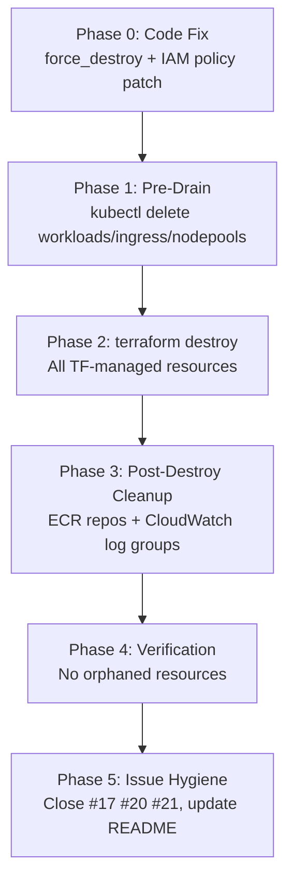
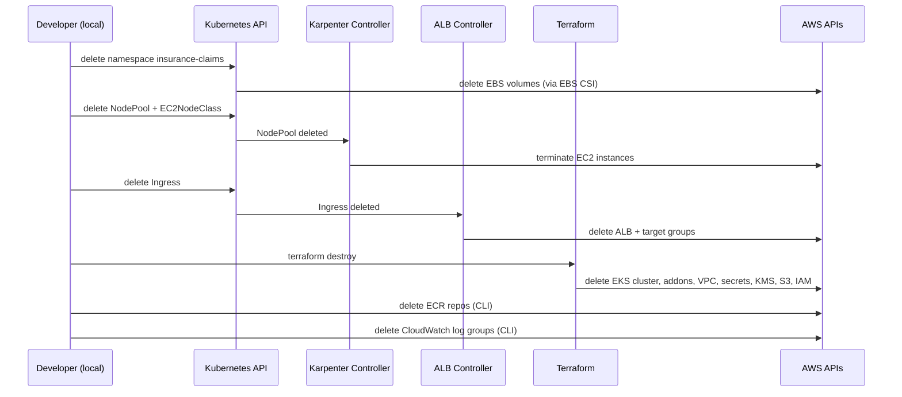
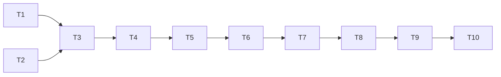

# Specification: EKS Cluster Teardown (Issue #25)

## 0. Research Findings

### Actual Scope (verified from codebase)

**Terraform-managed resources (will be destroyed by `terraform destroy`):**
- EKS cluster `agentic-eks-cluster` (terraform-aws-modules/eks ~> 20.31)
- EKS managed node group `general` (m5.large, 2 nodes)
- EKS OIDC provider (for IRSA) — distinct from GitHub Actions OIDC provider
- KMS key `eks-secrets` (7-day deletion window) + alias
- KMS key `secrets-encryption` (10-day deletion window) + alias
- VPC + 3 private subnets + 3 public subnets + NAT gateway + IGW + route tables + flow logs
- Security groups: `additional`, `langgraph_services`, `langgraph_alb`, `mongodb_rotation_lambda`
- Secrets Manager: `mongodb-credentials`, `mongodb-credentials-encrypted`, `langgraph-secrets` (all `recovery_window=0`)
- S3 bucket `langgraph-storage-*` (versioning enabled, `force_destroy` NOT set — needs fix)
- S3 bucket `app-data-*` (conditional, `force_destroy=true`)
- ALB `langgraph-alb` (Terraform-managed, `enable_deletion_protection=false`)
- CloudWatch log group `/aws/eks/agentic-eks-cluster/langgraph` (30-day retention)
- IRSA roles: `ebs-csi-driver`, `external-secrets`
- IAM policy `external-secrets-policy`, `langgraph-service-policy`
- IAM role `mongodb-rotation-lambda` + inline policy
- EKS Blueprints Addons module: Karpenter 1.7.1, ALB controller v2.17.1, External Secrets 0.11.0, metrics-server, EBS CSI driver, CoreDNS, VPC-CNI, kube-proxy
- Karpenter SQS queue + EventBridge rules (via `karpenter_enable_spot_termination=true`)
- Karpenter node IAM role + access entry
- `kubectl_manifest` resources: cpu-nodeclass, gpu-nodeclass (×2 — duplicate in karpenter-nodepools.tf AND production-terraform-addon.tf), cpu-nodepool, gpu-nodepool (×2 — same duplicate), gp3/gp3-high-performance/gp3-retain/gp2 StorageClasses, nvidia DaemonSet (conditional)
- `time_sleep.wait_for_karpenter` (120s)
- `random_string.bucket_suffix`, `random_password.*` resources

**NOT in Terraform state (require manual cleanup):**
- Kubernetes ALB from Ingress resource (`insurance-claims-alb-1814481405.us-west-2.elb.amazonaws.com`)
- Karpenter-provisioned EC2 nodes
- EBS volumes from MongoDB/Redis PVCs
- ECR repos: `insurance-claims/web-interface`, `insurance-claims/coordinator`, `insurance-claims/analytics`, `insurance-claims/simulator` (created by `build-docker-images.sh`)
- CloudWatch log group `/aws/eks/agentic-eks-cluster/cluster` (`create_cloudwatch_log_group=false`)
- Kubernetes namespace `insurance-claims` and all workloads within it

**MUST BE PRESERVED (not in TF state, safe from destroy):**
- IAM role `github-actions-deploy` (not in iam.tf)
- GitHub Actions OIDC provider `token.actions.githubusercontent.com` (created by bootstrap-cicd.sh)
- S3 state bucket `agentic-eks-terraform-state-621967485578` (is the backend, not a managed resource)

### Recommended Approach

**Hybrid: Pre-drain K8s workloads → `terraform destroy`**

Pre-drain eliminates all three VPC-blocking orphan risks (Karpenter EC2 nodes, Ingress ALB, PVC EBS volumes) before Terraform runs. After pre-drain, `terraform destroy` runs cleanly in ~20–30 min with high success rate.

### Alternatives Considered

| Option | Pros | Cons | Verdict |
|--------|------|------|---------|
| `terraform destroy` only | Single command | Karpenter nodes + Ingress ALB + PVCs orphaned; VPC deletion fails | ❌ Will fail |
| Targeted `-target` destroy | Can exclude resources | Doesn't solve orphan problem; 8–12 sequential invocations | ❌ High complexity |
| Manual console + `state rm` | Maximum control | 60+ resources; not repeatable; high orphan risk | ❌ Too slow |
| **Hybrid pre-drain + destroy** | Solves all orphan risks; repeatable; ~45 min total | Two-phase; requires kubectl access | ✅ Recommended |

### Edge Cases & Gotchas

- **Duplicate kubectl_manifest resources**: `gpu-nodepool` and `gpu-nodeclass` are defined in BOTH `karpenter-nodepools.tf` AND `production-terraform-addon.tf`. During destroy, the second delete gets a 404 and may error. Pre-deleting via kubectl avoids this.
- **`langgraph_storage` S3 bucket**: versioning is enabled but `force_destroy` is NOT set. `terraform destroy` will fail if the bucket is non-empty. Must add `force_destroy = true` before running destroy, or empty the bucket manually.
- **Kubernetes provider auth during destroy**: providers use `aws eks get-token` exec auth. If EKS cluster is deleted mid-destroy, subsequent `kubectl_manifest` deletions fail. TF dependency graph should handle ordering, but interrupted re-runs can break this.
- **`langgraph_storage` needs `s3:DeleteObjectVersion`**: versioning enabled; the `github-actions-deploy` role only has `s3:DeleteObject`, not `s3:DeleteObjectVersion`. Destroy will fail on versioned objects unless `force_destroy=true` is set (which handles this internally).
- **KMS keys**: 7–10 day pending deletion window is unavoidable. Keys continue to cost $1/month each during the window.
- **CloudWatch log group `/aws/eks/agentic-eks-cluster/cluster`**: NOT in TF state, will not be deleted by destroy. Manual cleanup required post-destroy.
- **ECR repos**: NOT in TF state. Manual `aws ecr delete-repository --force` required.
- **SQS + EventBridge for Karpenter**: ARE in TF state via `eks_blueprints_addons`. Will be destroyed correctly IF the `github-actions-deploy` role has `sqs:*` and `events:*` (currently missing — must be added before CI-based destroy).

### AWS Constraints

- **IAM permissions gap**: `github-actions-deploy` role is missing `sqs:*`, `events:*`, `s3:DeleteObjectVersion` for destroy. Must be patched before running destroy via CI.
- **EKS cluster deletion time**: 10–20 min for control plane; 20–40 min total with addons.
- **ENI cleanup time**: 5–15 min after node termination before VPC subnets can be deleted. Pre-drain mitigates this.
- **KMS minimum deletion window**: 7 days (AWS hard limit). Cannot be shortened.
- **ECR `--force` flag**: `aws ecr delete-repository --force` deletes all images atomically. No need to delete images first.
- **EIP release**: Handled automatically by vpc module when NAT GW is deleted.

### Known Limitations (out of scope)

- Secret rotation Lambda function was never deployed (placeholder only) — no Lambda to clean up.
- ACM certificate (`acm.tf`) — need to verify if any cert was provisioned.
- `production-terraform-addon.tf` contains duplicate Karpenter resources — not worth refactoring before destroy.

## 1. Requirements

### Problem Statement

The EKS cluster `agentic-eks-cluster` is generating ~300 Critical/High Linux kernel CVEs (kernel 6.12.74 → 6.12.85) with no path to resolution that isn't a perpetual treadmill. The cluster has no active production or demo use. The target architecture (CDK + Fargate, issues #2–#5) eliminates worker node OS management entirely. The cluster must be torn down surgically — destroying all EKS/VPC/supporting infrastructure while preserving the GitHub Actions OIDC role and Terraform state bucket needed for the CDK migration.

### Users

- **The Team** (hodok) — executing the teardown
- **GitHub Actions** (`github-actions-deploy` role) — must continue to function post-teardown for CDK work

### Functional Requirements

**Must Have:**
- FR1: All EKS cluster resources destroyed (control plane, managed node group, addons)
- FR2: VPC and all networking resources destroyed (subnets, NAT GW, IGW, route tables, flow logs, security groups)
- FR3: All Secrets Manager secrets deleted (`recovery_window=0` already set)
- FR4: All IRSA IAM roles and policies deleted
- FR5: KMS keys scheduled for deletion
- FR6: S3 `langgraph-storage` bucket emptied and deleted
- FR7: Karpenter-provisioned EC2 nodes terminated before VPC deletion
- FR8: Kubernetes Ingress ALB deleted before VPC deletion
- FR9: MongoDB/Redis PVC EBS volumes deleted before cluster destruction
- FR10: ECR repos (`insurance-claims/*`) deleted post-destroy
- FR11: Orphaned CloudWatch log group `/aws/eks/agentic-eks-cluster/cluster` deleted post-destroy
- FR12: `github-actions-deploy` IAM role preserved (not touched)
- FR13: GitHub Actions OIDC provider preserved (not touched)
- FR14: Terraform state bucket `agentic-eks-terraform-state-621967485578` preserved

**Should Have:**
- FR15: `langgraph_storage` S3 bucket gets `force_destroy = true` added before destroy runs
- FR16: `github-actions-deploy` role policy patched with missing `sqs:*`, `events:*`, `s3:DeleteObjectVersion` before CI-based destroy
- FR17: Issues #20 and #21 closed as won't-fix (moot after teardown)
- FR18: Issue #17 (torch CVEs) closed as won't-fix (analytics image gone after teardown)
- FR19: README updated to reflect teardown status and CDK migration in progress

**Nice to Have:**
- FR20: Teardown script (`scripts/teardown.sh`) created for repeatability and documentation
- FR21: Verification script to confirm no orphaned resources post-destroy

### Non-Functional Requirements

- NFR1: No orphaned AWS resources that continue to accrue cost after teardown
- NFR2: Teardown is safe to run from local machine (admin role) or CI (`github-actions-deploy` role)
- NFR3: `github-actions-deploy` role remains functional for CDK work immediately after teardown
- NFR4: Total teardown time < 60 minutes

### Constraints

- Must NOT delete `github-actions-deploy` IAM role
- Must NOT delete GitHub Actions OIDC provider (`token.actions.githubusercontent.com`)
- Must NOT delete S3 state bucket `agentic-eks-terraform-state-621967485578`
- Must run `terraform destroy` from `infrastructure/terraform/` with existing backend config
- KMS key deletion window minimum 7 days — unavoidable, accepted

### Integrations

- Terraform state: S3 backend `agentic-eks-terraform-state-621967485578/insurance-demo/terraform.tfstate`
- kubectl: requires `aws eks update-kubeconfig --name agentic-eks-cluster --region us-west-2` before pre-drain
- AWS CLI: `hodok-Isengard` assumed role (local) or `github-actions-deploy` (CI)

### Open Questions

- Q1: Should the teardown be run locally (admin role) or via CI (`github-actions-deploy`)? **Recommendation: locally first for safety; CI can be used if local access is unavailable.**
- Q2: Should `acm.tf` be checked for any provisioned ACM certificates before destroy? **Yes — add to pre-destroy checklist.**
- Q3: Should the Terraform state bucket be deleted after CDK has its own backend, or kept indefinitely? **Keep until CDK stack is confirmed stable.**

### Acceptance Criteria

- [ ] `terraform destroy` completes with exit code 0
- [ ] `aws eks describe-cluster --name agentic-eks-cluster` returns ResourceNotFoundException
- [ ] No EC2 instances with tag `karpenter.sh/discovery=agentic-eks-cluster` in running/pending state
- [ ] No ALBs with name containing `k8s` or `insurance` in us-west-2
- [ ] No VPCs with tag `Name=*agentic*` in us-west-2
- [ ] `aws iam get-role --role-name github-actions-deploy` succeeds
- [ ] `aws s3 ls s3://agentic-eks-terraform-state-621967485578` succeeds
- [ ] ECR repos `insurance-claims/*` deleted
- [ ] CloudWatch log group `/aws/eks/agentic-eks-cluster/cluster` deleted
- [ ] Issues #17, #20, #21 closed as won't-fix
- [ ] README updated

## 2. High-Level Design

### Overview

Two-phase teardown: (1) pre-drain Kubernetes resources that are outside Terraform state to eliminate VPC-blocking orphans, then (2) `terraform destroy` to remove all TF-managed resources. Post-destroy manual cleanup handles resources that were never in TF state (ECR, CloudWatch log groups).

### System Context



### Architectural Decisions

| Decision | Choice | Rationale |
|----------|--------|-----------|
| Destroy method | Hybrid pre-drain + `terraform destroy` | Only approach that reliably avoids VPC deletion failures |
| Execution context | Local (admin role) | Safer for first run; avoids CI permission gaps |
| `langgraph_storage` fix | Add `force_destroy = true` in code | Required for destroy to succeed on versioned bucket |
| IAM policy patch | Add `sqs:*`, `events:*`, `s3:DeleteObjectVersion` to `github-actions-deploy` | Required for CI-based destroy; also correct for CDK work |
| State bucket | Preserve | Needed until CDK stack has its own backend |
| Teardown script | Create `scripts/teardown.sh` | Documents the process; repeatable if needed |

### Major Phases

**Phase 0 — Code fixes (before running anything):**
- Add `force_destroy = true` to `aws_s3_bucket.langgraph_storage` in `production-terraform-addon.tf`
- Patch `github-actions-deploy` IAM role inline policy to add `sqs:*`, `events:*`, `s3:DeleteObjectVersion`

**Phase 1 — Pre-drain (kubectl, ~10–15 min):**
1. Delete `insurance-claims` namespace → releases PVCs → EBS CSI deletes EBS volumes
2. Delete Karpenter NodePools + EC2NodeClasses → Karpenter terminates its EC2 nodes
3. Delete all Ingress objects → ALB controller deletes the Kubernetes-managed ALB
4. Verify: no running Karpenter EC2 instances, no ALBs in VPC

**Phase 2 — `terraform destroy` (~20–35 min):**
- Run from `infrastructure/terraform/` with `terraform.tfvars`
- TF dependency graph handles ordering automatically
- Expected destroy order: kubectl_manifest → eks_blueprints_addons → IRSA roles → EKS cluster → KMS/Secrets/S3/ALB → security groups → VPC

**Phase 3 — Post-destroy cleanup (AWS CLI, ~5 min):**
- Delete ECR repos with `--force`
- Delete CloudWatch log group `/aws/eks/agentic-eks-cluster/cluster`
- Verify no orphaned ENIs, instances, ALBs, VPCs

**Phase 4 — Verification:**
- Run verification commands (see Acceptance Criteria)

**Phase 5 — Issue hygiene:**
- Close #17, #20, #21 as won't-fix
- Update README

### Data Flow



### Infrastructure

- No new infrastructure created — this is a pure teardown
- Terraform state bucket remains after destroy
- KMS keys enter pending deletion (7–10 day window)

### Risks and Mitigations

| Risk | Likelihood | Impact | Mitigation |
|------|-----------|--------|------------|
| VPC deletion fails due to orphaned ENIs | High (without pre-drain) | Blocks destroy | Pre-drain phase eliminates this |
| `langgraph_storage` destroy fails (no force_destroy) | High | Blocks destroy | Add `force_destroy=true` in Phase 0 |
| Duplicate kubectl_manifest resources cause 404 errors | Medium | TF error, re-run needed | Pre-delete via kubectl in Phase 1 |
| Kubernetes provider auth fails mid-destroy | Low | Partial destroy, re-run needed | Pre-drain removes all kubectl_manifest dependencies |
| `github-actions-deploy` accidentally deleted | Low | Blocks CDK work | Verified: not in TF state |
| KMS key re-creation conflict (if CDK reuses same alias) | Low | CDK deploy fails | CDK will use different alias names |

## 3. Low-Level Design

### Component Design

#### 3.1 Phase 0: Code Fixes

**`production-terraform-addon.tf` — add `force_destroy`:**
```hcl
resource "aws_s3_bucket" "langgraph_storage" {
  bucket        = "${local.name}-langgraph-storage-${random_string.bucket_suffix.result}"
  force_destroy = true   # ADD THIS LINE
  tags          = local.tags
}
```

**`scripts/bootstrap-cicd.sh` or inline — patch `github-actions-deploy` policy:**
Add to the existing inline policy document:
```json
{ "Effect": "Allow", "Action": ["sqs:*"], "Resource": "*" },
{ "Effect": "Allow", "Action": ["events:*"], "Resource": "*" },
{ "Effect": "Allow", "Action": ["s3:DeleteObjectVersion", "s3:DeleteObjectVersionTagging"], "Resource": "*" }
```
This is done via `aws iam put-role-policy` targeting the existing `deploy-permissions` inline policy.

#### 3.2 Phase 1: Pre-Drain Script (`scripts/teardown.sh` — pre-drain section)

```bash
#!/usr/bin/env bash
set -euo pipefail

CLUSTER=agentic-eks-cluster
REGION=us-west-2
NAMESPACE=insurance-claims

echo "=== Step 1: Update kubeconfig ==="
aws eks update-kubeconfig --name "$CLUSTER" --region "$REGION"

echo "=== Step 2: Delete app namespace (releases PVCs → EBS volumes) ==="
kubectl delete namespace "$NAMESPACE" --wait=true --timeout=120s || true

echo "=== Step 3: Delete Karpenter NodePools + EC2NodeClasses ==="
kubectl delete nodepool --all --wait=true --timeout=300s || true
kubectl delete ec2nodeclass --all --wait=true --timeout=60s || true

echo "=== Step 4: Wait for Karpenter EC2 nodes to terminate ==="
for i in $(seq 1 30); do
  COUNT=$(aws ec2 describe-instances --region "$REGION" \
    --filters "Name=tag:karpenter.sh/discovery,Values=$CLUSTER" \
              "Name=instance-state-name,Values=running,pending,stopping" \
    --query 'length(Reservations[*].Instances[*])' --output text)
  [ "$COUNT" -eq 0 ] && echo "All Karpenter nodes terminated." && break
  echo "  Waiting for $COUNT Karpenter node(s) to terminate... ($i/30)"
  sleep 10
done

echo "=== Step 5: Delete all Ingress objects (triggers ALB deletion) ==="
kubectl delete ingress --all -A --wait=true --timeout=60s || true

echo "=== Step 6: Wait for ALB deletion ==="
for i in $(seq 1 12); do
  COUNT=$(aws elbv2 describe-load-balancers --region "$REGION" \
    --query "length(LoadBalancers[?contains(LoadBalancerName,'k8s') || contains(LoadBalancerName,'insurance')])" \
    --output text)
  [ "$COUNT" -eq 0 ] && echo "ALB deleted." && break
  echo "  Waiting for ALB deletion... ($i/12)"
  sleep 10
done

echo "=== Pre-drain complete. Ready for terraform destroy. ==="
```

#### 3.3 Phase 2: Terraform Destroy

```bash
cd infrastructure/terraform
terraform init   # re-init to confirm backend connectivity
terraform plan -destroy -var-file=terraform.tfvars -out=destroy.plan
# Review plan — confirm github-actions-deploy and state bucket NOT in plan
terraform apply destroy.plan
```

Key verification before applying: `terraform state list | grep oidc` must NOT show `token.actions.githubusercontent.com`.

#### 3.4 Phase 3: Post-Destroy Cleanup Script (teardown.sh — cleanup section)

```bash
echo "=== Post-destroy: Delete ECR repos ==="
for REPO in web-interface coordinator analytics simulator; do
  aws ecr delete-repository \
    --repository-name "insurance-claims/$REPO" \
    --force --region "$REGION" 2>/dev/null || echo "  $REPO not found (already deleted)"
done

echo "=== Post-destroy: Delete orphaned CloudWatch log groups ==="
aws logs delete-log-group \
  --log-group-name "/aws/eks/$CLUSTER/cluster" \
  --region "$REGION" 2>/dev/null || echo "  Log group not found"

echo "=== Post-destroy: Verify no orphaned resources ==="
echo "--- Karpenter EC2 instances ---"
aws ec2 describe-instances --region "$REGION" \
  --filters "Name=tag:karpenter.sh/discovery,Values=$CLUSTER" \
            "Name=instance-state-name,Values=running,pending" \
  --query 'Reservations[*].Instances[*].[InstanceId,State.Name]' --output table

echo "--- ALBs ---"
aws elbv2 describe-load-balancers --region "$REGION" \
  --query 'LoadBalancers[?contains(LoadBalancerName,`k8s`) || contains(LoadBalancerName,`insurance`)].LoadBalancerArn' \
  --output table

echo "--- VPCs ---"
aws ec2 describe-vpcs --region "$REGION" \
  --filters "Name=tag:Name,Values=*agentic*" \
  --query 'Vpcs[*].[VpcId,State]' --output table

echo "--- Preserved resources (should still exist) ---"
aws iam get-role --role-name github-actions-deploy --query 'Role.RoleName' --output text
aws s3 ls "s3://agentic-eks-terraform-state-621967485578" > /dev/null && echo "State bucket: OK"
```

### Error Handling Strategy

| Error | Cause | Recovery |
|-------|-------|----------|
| `VPC has dependencies` during destroy | Orphaned ENIs from Karpenter/ALB | Re-run pre-drain; manually delete ENIs via `aws ec2 delete-network-interface` |
| `BucketNotEmpty` on langgraph_storage | `force_destroy` not set | Add `force_destroy=true`, re-run `terraform apply` first, then destroy |
| `kubectl_manifest` 404 on duplicate resource | gpu-nodepool/nodeclass defined twice | Ignore error; re-run `terraform destroy` — idempotent |
| Kubernetes provider auth failure mid-destroy | EKS cluster deleted before kubectl_manifest | Run `terraform destroy -target=module.eks_blueprints_addons` first, then full destroy |
| `AccessDenied` on SQS/EventBridge | Missing IAM permissions | Patch `github-actions-deploy` policy (Phase 0) |

### Configuration

No new configuration files. Changes are:
- `infrastructure/terraform/production-terraform-addon.tf`: add `force_destroy = true`
- `scripts/teardown.sh`: new file (pre-drain + post-cleanup)
- `scripts/bootstrap-cicd.sh`: patch IAM policy section (or apply via AWS CLI directly)

## 4. Task Plan

### Progress Summary

0 of 10 tasks complete.

### Task Status

| ID | Task | Status | Depends On |
|----|------|--------|------------|
| T1 | Add `force_destroy=true` to `langgraph_storage` S3 bucket | ⬜ TODO | — |
| T2 | Patch `github-actions-deploy` IAM policy (sqs, events, s3:DeleteObjectVersion) | ⬜ TODO | — |
| T3 | Create `scripts/teardown.sh` (pre-drain + post-cleanup) | ⬜ TODO | T1, T2 |
| T4 | Run pre-drain: delete namespace, NodePools, Ingress; verify no orphans | ⬜ TODO | T3 |
| T5 | Run `terraform plan -destroy` and review (confirm preserved resources not in plan) | ⬜ TODO | T4 |
| T6 | Run `terraform apply destroy.plan` | ⬜ TODO | T5 |
| T7 | Post-destroy cleanup: delete ECR repos + CloudWatch log groups | ⬜ TODO | T6 |
| T8 | Run verification commands; confirm all acceptance criteria pass | ⬜ TODO | T7 |
| T9 | Close issues #17, #20, #21 as won't-fix with explanation | ⬜ TODO | T8 |
| T10 | Update README to reflect teardown complete, CDK migration in progress | ⬜ TODO | T9 |

### Eligible Tasks (can start now)

- T1 — code change, no dependencies
- T2 — IAM policy patch, no dependencies

### Dependency Graph



### Detailed Task Definitions

**T1 — Add `force_destroy=true` to `langgraph_storage`**
- File: `infrastructure/terraform/production-terraform-addon.tf`
- Change: add `force_destroy = true` to `aws_s3_bucket.langgraph_storage`
- Verify: `terraform plan` shows no unexpected changes (force_destroy is not a real AWS attribute, no diff expected)

**T2 — Patch `github-actions-deploy` IAM policy**
- ✅ VERIFIED NO-OP: Policy already contains `sqs:*` (Sid: SQS), `events:*` (Sid: EventBridge), and `s3:*` (Sid: S3) which covers `s3:DeleteObjectVersion`. Confirmed via `aws iam simulate-principal-policy` — all three actions return `allowed`.
- No change required.

**T3 — Create `scripts/teardown.sh`**
- Combines pre-drain steps and post-cleanup steps from LLD section 3.2 and 3.4
- Make executable: `chmod +x scripts/teardown.sh`
- Dry-run test: verify script syntax with `bash -n scripts/teardown.sh`

**T4 — Run pre-drain**
- Execute pre-drain section of `scripts/teardown.sh` (or run steps manually)
- Gate: do not proceed until Karpenter EC2 count = 0 AND ALB count = 0

**T5 — Review destroy plan**
- `terraform plan -destroy -var-file=terraform.tfvars -out=destroy.plan`
- Verify: `github-actions-deploy` NOT in plan; state bucket NOT in plan; GitHub OIDC provider NOT in plan
- Verify: `terraform state list | grep oidc` shows only EKS OIDC provider

**T6 — Execute `terraform destroy`**
- `terraform apply destroy.plan`
- Expected duration: 20–35 min
- If VPC deletion fails: check for orphaned ENIs, delete manually, re-run

**T7 — Post-destroy cleanup**
- Delete ECR repos: `aws ecr delete-repository --force` for each of 4 repos
- Delete CloudWatch log group: `aws logs delete-log-group --log-group-name /aws/eks/agentic-eks-cluster/cluster`

**T8 — Verification**
- Run all verification commands from Acceptance Criteria section
- All checks must pass before proceeding

**T9 — Close issues**
- Close #17 (torch CVEs): "Won't fix — analytics image removed as part of EKS teardown (#25). Moot."
- Close #20 (coordinator crash): "Won't fix — EKS stack torn down (#25). Moot."
- Close #21 (ExternalSecrets IRSA): "Won't fix — EKS stack torn down (#25). Moot."

**T10 — Update README**
- Update badges (remove EKS/Kubernetes/Terraform badges, add CDK/Fargate/DynamoDB)
- Update architecture section to note migration in progress
- Update Quick Start to note current stack is being replaced
