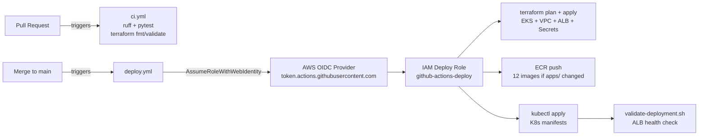
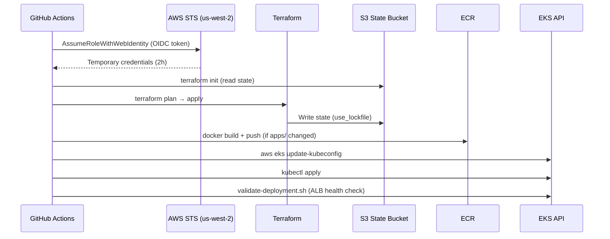
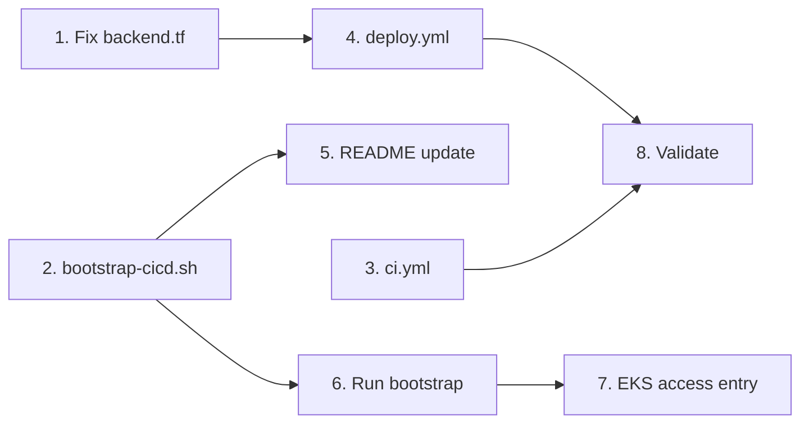

# Specification: GitHub Actions CI/CD with OIDC for Current Stack (Issue #7)

**Issue:** [#7](https://github.com/khodo-lab/sample-agentic-insurance-claims-processing-fargate/issues/7)  
**Branch:** `feature/issue-7-github-actions-oidc`  
**Status:** In Progress — Phase 1 (Requirements) awaiting approval

---

## 0. Research Findings

### Actual Scope (audited from codebase)

- **No existing `.github/workflows/`** — starting from scratch
- **12 Dockerfiles** in `applications/insurance-claims-processing/docker/`: coordinator, web-interface, shared-memory, policy-agent, fraud-agent, investigation-agent, claims-simulator, analytics, external-integrations, human-workflow, langgraph, demo-generator. Plus 1 GPU image (ollama-qwen) — **skip GPU image in CI** (no GPU runners).
- **Terraform S3 backend** (`backend.tf`): bucket=`agentic-eks-terraform-state`, key=`insurance-demo/terraform.tfstate`, region=`us-west-2`. **No DynamoDB lock table and no `use_lockfile`** — state locking is absent.
- **ECR repos are NOT in Terraform** — created imperatively in `build-docker-images.sh` and `deploy.sh` via `aws ecr create-repository`. The deploy role needs `ecr:CreateRepository`.
- **EKS public endpoint** is enabled with `0.0.0.0/0` CIDR — GitHub-hosted runners can reach it.
- **Existing scripts** (`scripts/`) already handle ECR login, parallel Docker builds, ordered K8s deployment, and validation. Workflows should be thin orchestrators that call these scripts.
- **Terraform version constraint:** `>= 1.9` in `versions.tf`. A stale commented-out backend block in `versions.tf` references a different bucket — should be removed.
- **`providers.tf` uses `aws.virginia` alias** for ECR Public (Karpenter Helm chart). Deploy role needs `ecr-public:GetAuthorizationToken` in us-east-1.
- **Sensitive Terraform output:** `cluster_certificate_authority_data` — must not be logged.
- **Secrets Manager values in Terraform state** — S3 bucket must have encryption enabled.

### Recommended Approach

**Split CI + CD workflows, single OIDC deploy role, inline steps calling existing scripts, `terraform validate/fmt` on PRs (no creds), `terraform plan + apply` on main, `aws eks update-kubeconfig` for kubectl, add state locking via `use_lockfile = true` (Terraform 1.10+) or DynamoDB table.**

The existing shell scripts are the implementation. GitHub Actions is just the trigger. Keep workflows thin.

### Alternatives Considered

| Decision | Chosen | Rejected | Reason |
|---|---|---|---|
| Workflow structure | Split CI + CD | Single monolithic | OIDC trust is main-only; PRs can't assume deploy role anyway. Clean separation. |
| IAM roles | Single deploy role | Separate roles per job | Demo repo, single deployer, single account. Role separation adds complexity without benefit at this scale. |
| Workflow abstraction | Inline steps → existing scripts | Reusable workflows | Scripts already exist and work locally. Reusable workflows add indirection for 2 files. |
| Docker builds | Single job, existing script | Matrix (12 parallel jobs) | Script already parallelizes builds. Matrix = 12x runner startup overhead for a demo repo. |
| Terraform on PRs | `validate`/`fmt` only (no creds) | `terraform plan` on PRs | OIDC trust is scoped to `main` only — PRs can't assume the role. Validate/fmt catches syntax errors without needing AWS creds. |
| kubectl auth | `aws eks update-kubeconfig` | kubectl action / `get-token` | Standard AWS approach, one line, works with existing deploy scripts. |
| State locking | `use_lockfile = true` (Terraform 1.10) | DynamoDB table | Simpler — no extra AWS resource to bootstrap. Requires bumping Terraform min version to 1.10. |

### Edge Cases & Gotchas

**Critical (must fix before enabling CI/CD):**
- **No state locking** — concurrent Terraform runs can corrupt state. Fix: add `use_lockfile = true` to `backend.tf` and bump Terraform to `>= 1.10`.
- **S3 backend bucket must pre-exist** — `terraform init` fails if bucket doesn't exist. Document as one-time bootstrap step.
- **ECR repos not in Terraform** — `docker push` fails if repos don't exist. Workflow must create repos before pushing (or add to Terraform).
- **OIDC `permissions: id-token: write`** — must be set in the deploy workflow or OIDC silently falls back to looking for `AWS_ACCESS_KEY_ID` and fails with a confusing error.
- **Chicken-and-egg: EKS access entry** — the deploy role must have an EKS access entry before `terraform apply` can run (Kubernetes/Helm providers authenticate via EKS). Bootstrap sequence: create OIDC provider + deploy role manually → add EKS access entry → then CI can run.

**Important (handle in implementation):**
- **OIDC sub-claim format** — trust condition must use `token.actions.githubusercontent.com:sub` with value `repo:khodo-lab/...:ref:refs/heads/main`. PR events use a different sub-claim and will correctly fail to assume the role.
- **IAM role session duration** — default 1 hour may not be enough for Terraform + 12 Docker builds. Set `role-duration-seconds: 7200` and update role `MaxSessionDuration` to 7200.
- **ECR Public token requires us-east-1** — deploy role needs `ecr-public:GetAuthorizationToken` in us-east-1 (for Karpenter Helm chart).
- **Karpenter provisioning delay** — pods go Pending for 30-120s after `kubectl apply`. Use `kubectl rollout status --timeout=300s` not `kubectl get pods`.
- **Sensitive Terraform output** — never run `terraform output -json` in CI without filtering. Use `TF_LOG=ERROR`.
- **Stale commented-out backend in `versions.tf`** — remove it to avoid confusion.
- **GPU image (ollama-qwen)** — skip in CI; GitHub-hosted runners have no GPU.
- **Concurrent PR workflows** — use `concurrency` groups to serialize Terraform operations.
- **Regional STS endpoint** — set `AWS_STS_REGIONAL_ENDPOINTS: regional` to avoid global STS endpoint dependency.

### AWS Constraints

| Constraint | Value | Notes |
|---|---|---|
| OIDC providers per account | 100 (hard limit) | This project uses 2 (GitHub + EKS). No concern. |
| IAM role max session duration | Up to 12h (configurable) | Default is 1h. Must update role to allow 2h. |
| ECR login token TTL | 12 hours | Not the bottleneck. OIDC session duration is. |
| EKS kubeconfig token TTL | 15 minutes | Auto-refreshes via exec plugin as long as AWS session is valid. |
| `configure-aws-credentials` version | v4 (Node 20) | v3 deprecated. Use v4. |
| Terraform `use_lockfile` | Requires >= 1.10 | Current constraint is >= 1.9. Must bump. |
| S3 backend bucket | Must pre-exist | Cannot be created by the same Terraform config. |
| EKS access entry | Must pre-exist for deploy role | Bootstrap step before first CI run. |

**Minimum IAM permissions for deploy role:**

```
# Terraform (EKS + VPC + ALB + Secrets Manager + S3 + IAM + Karpenter)
eks:*, ec2:*, elasticloadbalancing:*, secretsmanager:*, s3:*, iam:PassRole,
iam:CreateRole, iam:AttachRolePolicy, iam:PutRolePolicy, iam:GetRole,
iam:DeleteRole, iam:DetachRolePolicy, iam:ListRolePolicies,
kms:*, logs:*, cloudwatch:*

# Kubernetes/Helm providers (via EKS)
eks:DescribeCluster, eks:ListClusters, eks:AccessKubernetesApi

# ECR (private)
ecr:GetAuthorizationToken, ecr:BatchCheckLayerAvailability,
ecr:GetDownloadUrlForLayer, ecr:BatchGetImage, ecr:PutImage,
ecr:InitiateLayerUpload, ecr:UploadLayerPart, ecr:CompleteLayerUpload,
ecr:CreateRepository, ecr:DescribeRepositories

# ECR Public (us-east-1, for Karpenter Helm chart)
ecr-public:GetAuthorizationToken, ecr-public:BatchCheckLayerAvailability,
ecr-public:GetRepositoryPolicy, ecr-public:DescribeRepositories,
ecr-public:DescribeImageTags, ecr-public:DescribeImages, ecr-public:GetRepositoryCatalogData

# S3 backend
s3:GetObject, s3:PutObject, s3:ListBucket, s3:DeleteObject, s3:GetBucketVersioning
```

### Open Questions (resolved by research)

- ✅ **DynamoDB vs `use_lockfile`?** → Use `use_lockfile = true` (Terraform 1.10+). Simpler, no extra resource.
- ✅ **Single role vs multiple?** → Single role for this demo repo.
- ✅ **Matrix builds?** → No. Use existing script's built-in parallelism.
- ✅ **`terraform plan` on PRs?** → No (OIDC trust is main-only). Use `validate`/`fmt` instead.

---

## 1. Requirements

### Problem Statement

The repository has no CI/CD pipeline. Deployments are manual (run `./scripts/deploy.sh` locally). There is no automated testing gate on PRs, no automated infrastructure deployment on merge, and no OIDC trust configured between GitHub Actions and AWS. This means:
- PRs can merge with broken code or invalid Terraform
- Deployments require a developer with local AWS credentials
- No audit trail of what was deployed and when

### Users

- **Developers** — want PRs to be automatically validated (lint, test, terraform validate) before merge
- **The Team** — wants merges to `main` to automatically deploy to AWS without manual intervention
- **Reviewers** — want to see that code passes checks before approving a PR

### Functional Requirements

**Must Have:**
- FR-1: On every PR, run Python lint (`ruff`) and `pytest` (Python 3.11, unit tests only — no DB/Redis required)
- FR-2: On every PR, run `terraform fmt -check` and `terraform validate` (no AWS creds required; confirmed cred-free for this codebase)
- FR-3: On merge to `main`, assume the OIDC deploy role, run `terraform plan` (output to step summary), then `terraform apply`
- FR-4: On merge to `main`, detect changes in `applications/` — if changed, build all 12 non-GPU Docker images in parallel (using existing `build-docker-images.sh`) and push to ECR tagged with `github.sha`; if no application code changed, skip Docker build entirely
- FR-5: On merge to `main`, run `aws eks update-kubeconfig --name agentic-eks-cluster --region us-west-2` then `kubectl apply` to roll out Kubernetes manifests
- FR-6: On merge to `main`, run `./scripts/validate-deployment.sh` as a post-deploy health check (script exists and checks pod status + ALB reachability)
- FR-7: OIDC identity provider `token.actions.githubusercontent.com` must be configured in account `597088050001`
- FR-8: IAM deploy role must have trust policy scoped to `repo:khodo-lab/sample-agentic-insurance-claims-processing-fargate:ref:refs/heads/main` only
- FR-9: No long-lived AWS credentials stored in GitHub secrets
- FR-10: Terraform state locking must be enabled (`use_lockfile = true`, Terraform >= 1.10) before CI/CD runs `terraform apply`; this is a bootstrap prerequisite documented in FR-11
- FR-11: README must document the one-time bootstrap steps: S3 bucket creation (bucket does not exist — must be created), OIDC provider creation, deploy role creation, EKS access entry, and state locking setup
- FR-13: `concurrency` groups to prevent concurrent Terraform runs (promoted from Should Have — without this, parallel merges cause apply collisions even with state locking)

**Should Have:**
- FR-14: Regional STS endpoint (`AWS_STS_REGIONAL_ENDPOINTS: regional`) to avoid global STS dependency
- FR-15: ECR image scanning enabled on push (`scanOnPush=true`)

**Nice to Have:**
- FR-16: Post plan/apply summary as a GitHub Actions step summary (not PR comment — avoids leaking sensitive values on public repos)
- FR-17: ECR lifecycle policy to expire untagged images after 30 days

### Non-Functional Requirements

- NFR-1: PR checks must complete in < 5 minutes (lint + test + terraform validate)
- NFR-2: Full deploy workflow must complete in < 30 minutes (terraform apply + 12 Docker builds + kubectl apply)
- NFR-3: No secrets or sensitive Terraform outputs in workflow logs (`TF_LOG=ERROR`, no `terraform output -json`)
- NFR-4: Workflows must be readable and maintainable — thin orchestrators calling existing scripts
- NFR-5: IAM role follows least-privilege (scoped to exact actions needed, not `*` on all services)

### Constraints

- OIDC trust is scoped to `main` branch only — PRs cannot assume the deploy role
- Terraform version must be bumped to `>= 1.10` to use `use_lockfile = true`
- GPU image (ollama-qwen) is excluded from CI builds (no GPU runners)
- S3 backend bucket, OIDC provider, deploy role, and EKS access entry must be bootstrapped manually before first CI run
- This issue is superseded by #6 (GitHub Actions for CDK + Fargate stack) — keep it simple, don't over-engineer

### Integrations

- GitHub Actions (CI/CD platform)
- AWS IAM (OIDC provider + deploy role)
- AWS S3 (Terraform state backend)
- AWS ECR (Docker image registry)
- AWS EKS (Kubernetes cluster)
- Existing scripts: `build-docker-images.sh`, `deploy-infrastructure.sh`, `deploy-kubernetes.sh`, `validate-deployment.sh`

### Acceptance Criteria

- [ ] OIDC provider `token.actions.githubusercontent.com` exists in account `597088050001`
- [ ] Deploy IAM role exists with trust policy scoped to `main` branch only
- [ ] PR CI workflow runs lint + test + terraform validate/fmt and blocks merge on failure
- [ ] Merge to `main` triggers terraform apply + Docker build + kubectl apply
- [ ] App is reachable at the ALB URL after deploy
- [ ] No long-lived AWS credentials in GitHub secrets
- [ ] Terraform state locking is enabled (`use_lockfile = true`)
- [ ] README documents the one-time bootstrap steps

---

## 2. High-Level Design

### Overview

Two GitHub Actions workflow files. `ci.yml` runs on every PR — validates code and Terraform syntax without AWS credentials. `deploy.yml` runs on every push to `main` — assumes the OIDC deploy role, applies Terraform, conditionally builds and pushes Docker images (only if `applications/` changed), then rolls out Kubernetes manifests and validates.

A one-time bootstrap script (`scripts/bootstrap-cicd.sh`) creates the AWS prerequisites that must exist before the first workflow run.

### System Context



### Architectural Decisions

| Decision | Choice | Rationale |
|---|---|---|
| Workflow structure | Split CI + CD | OIDC trust is main-only; clean separation of concerns |
| IAM roles | Single deploy role | Demo repo, single deployer, single account |
| Workflow implementation | Inline steps → existing scripts | Scripts already exist and work locally |
| Docker build trigger | Change detection on `applications/` | Avoid rebuilding 12 images on every Terraform-only change |
| Change detection mechanism | `dorny/paths-filter@v3` | Lightweight, no AWS creds needed, outputs a boolean |
| Terraform on PRs | `fmt -check` + `validate` only | OIDC trust is main-only; PRs can't assume the role |
| State locking | `use_lockfile = true` (Terraform 1.10+) | No extra AWS resource; simpler bootstrap |
| kubectl auth | `aws eks update-kubeconfig` | Standard, one-liner, works with existing scripts |
| Rollback | Re-run the workflow | Acceptable for demo baseline |

### Major Components

**`scripts/bootstrap-cicd.sh`** (new)
- Creates S3 state bucket with versioning + encryption
- Creates DynamoDB lock table (or documents `use_lockfile` approach)
- Creates OIDC provider in IAM
- Creates IAM deploy role with trust policy + permissions
- Prints instructions for the EKS access entry (must be done after EKS exists)

**`.github/workflows/ci.yml`** (new)
- Trigger: `pull_request` to `main`
- Jobs: `lint-test` (ruff + pytest, Python 3.11), `terraform-validate` (fmt-check + validate, no creds)
- No AWS credentials required

**`.github/workflows/deploy.yml`** (new)
- Trigger: `push` to `main`
- Concurrency group: `deploy-main`, `cancel-in-progress: false`
- Jobs (sequential):
  1. `terraform` — configure AWS creds (OIDC), plan → apply
  2. `build-push` — detect changes in `applications/`; if changed, build + push 12 images
  3. `deploy-k8s` — `aws eks update-kubeconfig`, `kubectl apply`, `validate-deployment.sh`

**`infrastructure/terraform/backend.tf`** (modified)
- Add `use_lockfile = true`

**`infrastructure/terraform/versions.tf`** (modified)
- Bump Terraform constraint to `>= 1.10`
- Remove stale commented-out backend block

**`README.md`** (modified)
- Add CI/CD section with bootstrap instructions

### Data Flow



### Security Concerns

- OIDC trust scoped to `main` branch only — PRs cannot trigger deploys
- `permissions: id-token: write` required in deploy workflow (explicit, not inherited)
- `TF_LOG=ERROR` to suppress verbose Terraform output that may contain interpolated secrets
- No `terraform output -json` in CI — avoids leaking `cluster_certificate_authority_data`
- IAM role session duration: 7200s (2h) to cover full deploy duration
- Regional STS endpoint (`AWS_STS_REGIONAL_ENDPOINTS: regional`) to avoid global STS dependency

### Infrastructure

New AWS resources (created by bootstrap script, not by Terraform):
- S3 bucket: `agentic-eks-terraform-state` (versioning + SSE-S3 encryption)
- IAM OIDC provider: `token.actions.githubusercontent.com`
- IAM role: `github-actions-deploy` (trust: main branch only, MaxSessionDuration: 7200s)

Modified Terraform files:
- `backend.tf`: add `use_lockfile = true`
- `versions.tf`: bump to `>= 1.10`, remove stale backend comment

### Dependencies

- `dorny/paths-filter@v3` — change detection (pinned, well-maintained)
- `aws-actions/configure-aws-credentials@v4` — OIDC credential exchange
- `aws-actions/amazon-ecr-login@v2` — ECR authentication
- `hashicorp/setup-terraform@v3` — Terraform installation
- Existing scripts: `build-docker-images.sh`, `deploy-infrastructure.sh`, `deploy-kubernetes.sh`, `validate-deployment.sh`

### Risks and Mitigations

| Risk | Likelihood | Mitigation |
|---|---|---|
| First `terraform apply` shows drift (resources already exist) | Medium | Run `terraform plan` manually first; review before enabling auto-apply |
| Karpenter provisioning delay causes false failure | Medium | Use `kubectl rollout status --timeout=300s` not `kubectl get pods` |
| ECR repos don't exist on first push | High | Bootstrap script creates repos, or workflow creates them before push |
| EKS access entry not set for deploy role | High | Bootstrap script prints instructions; documented in README |
| `terraform apply` fails mid-run | Low | Re-run workflow (acceptable for demo baseline) |

---

## 3. Low-Level Design

### Component Design

---

#### `scripts/bootstrap-cicd.sh`

**Responsibility:** One-time setup of all AWS prerequisites before the first CI/CD run. Idempotent — safe to re-run.

**Steps (in order):**
1. Create S3 bucket `agentic-eks-terraform-state` with versioning + SSE-S3 encryption (skip if exists)
2. Create IAM OIDC provider for `token.actions.githubusercontent.com` with thumbprint + audience `sts.amazonaws.com` (skip if exists)
3. Create IAM role `github-actions-deploy` with trust policy (main branch only) + inline permissions policy (skip if exists)
4. Update role `MaxSessionDuration` to 7200
5. Print manual step: "After EKS cluster exists, run: `aws eks create-access-entry --cluster-name agentic-eks-cluster --principal-arn arn:aws:iam::597088050001:role/github-actions-deploy --type STANDARD`"

**IAM trust policy (exact):**
```json
{
  "Version": "2012-10-17",
  "Statement": [{
    "Effect": "Allow",
    "Principal": {"Federated": "arn:aws:iam::597088050001:oidc-provider/token.actions.githubusercontent.com"},
    "Action": "sts:AssumeRoleWithWebIdentity",
    "Condition": {
      "StringEquals": {
        "token.actions.githubusercontent.com:aud": "sts.amazonaws.com",
        "token.actions.githubusercontent.com:sub": "repo:khodo-lab/sample-agentic-insurance-claims-processing-fargate:ref:refs/heads/main"
      }
    }
  }]
}
```

**IAM permissions policy — scoped to what Terraform + ECR + EKS actually need:**
```
ec2:*, eks:*, elasticloadbalancing:*, autoscaling:Describe*,
iam:CreateRole, iam:DeleteRole, iam:GetRole, iam:ListRoles,
iam:AttachRolePolicy, iam:DetachRolePolicy, iam:PutRolePolicy,
iam:DeleteRolePolicy, iam:GetRolePolicy, iam:ListRolePolicies,
iam:ListAttachedRolePolicies, iam:PassRole, iam:CreateInstanceProfile,
iam:DeleteInstanceProfile, iam:GetInstanceProfile, iam:AddRoleToInstanceProfile,
iam:RemoveRoleFromInstanceProfile, iam:CreateOpenIDConnectProvider,
iam:DeleteOpenIDConnectProvider, iam:GetOpenIDConnectProvider,
iam:TagOpenIDConnectProvider,
secretsmanager:CreateSecret, secretsmanager:DeleteSecret,
secretsmanager:GetSecretValue, secretsmanager:PutSecretValue,
secretsmanager:DescribeSecret, secretsmanager:TagResource,
s3:CreateBucket, s3:DeleteBucket, s3:GetBucketVersioning,
s3:PutBucketVersioning, s3:GetObject, s3:PutObject,
s3:DeleteObject, s3:ListBucket, s3:GetBucketPolicy,
s3:PutBucketPolicy, s3:GetEncryptionConfiguration,
s3:PutEncryptionConfiguration,
kms:CreateKey, kms:DescribeKey, kms:GetKeyPolicy,
kms:PutKeyPolicy, kms:ScheduleKeyDeletion, kms:CreateAlias,
kms:DeleteAlias, kms:TagResource,
logs:CreateLogGroup, logs:DeleteLogGroup, logs:DescribeLogGroups,
logs:PutRetentionPolicy, logs:TagLogGroup,
ecr:GetAuthorizationToken, ecr:CreateRepository,
ecr:DescribeRepositories, ecr:BatchCheckLayerAvailability,
ecr:GetDownloadUrlForLayer, ecr:BatchGetImage, ecr:PutImage,
ecr:InitiateLayerUpload, ecr:UploadLayerPart,
ecr:CompleteLayerUpload, ecr:PutLifecyclePolicy,
ecr:PutImageScanningConfiguration,
ecr-public:GetAuthorizationToken,
ecr-public:BatchCheckLayerAvailability,
ecr-public:GetRepositoryPolicy,
ecr-public:DescribeRepositories,
acm:RequestCertificate, acm:DescribeCertificate,
acm:DeleteCertificate, acm:ListCertificates,
acm:AddTagsToCertificate,
wafv2:CreateWebACL, wafv2:DeleteWebACL, wafv2:GetWebACL,
wafv2:UpdateWebACL, wafv2:ListWebACLs, wafv2:TagResource
```

---

#### `.github/workflows/ci.yml`

**Trigger:** `pull_request` targeting `main`

**Permissions:** `contents: read` only (no `id-token`)

**Jobs:**

`lint-test`:
```
- actions/checkout@v4
- actions/setup-python@v5 (python-version: '3.11')
- pip install ruff pytest (from requirements-langgraph.txt)
- ruff check applications/
- pytest applications/insurance-claims-processing/tests/ -x -q
  (unit tests only — no DB/Redis; skip integration tests via marker)
```

`terraform-validate`:
```
- actions/checkout@v4
- hashicorp/setup-terraform@v3 (terraform_version: 1.10.x)
- terraform -chdir=infrastructure/terraform fmt -check -recursive
- terraform -chdir=infrastructure/terraform init -backend=false
- terraform -chdir=infrastructure/terraform validate
```
Note: `init -backend=false` skips S3 backend connection — no AWS creds needed.

---

#### `.github/workflows/deploy.yml`

**Trigger:** `push` to `main`

**Permissions:** `contents: read`, `id-token: write`

**Concurrency:**
```yaml
concurrency:
  group: deploy-main
  cancel-in-progress: false
```

**Environment variables (top-level):**
```yaml
env:
  AWS_REGION: us-west-2
  AWS_ACCOUNT: 597088050001
  EKS_CLUSTER: agentic-eks-cluster
  AWS_STS_REGIONAL_ENDPOINTS: regional
  TF_LOG: ERROR
```

**Job 1 — `terraform`:**
```
- actions/checkout@v4
- hashicorp/setup-terraform@v3 (terraform_version: 1.10.x, terraform_wrapper: false)
- aws-actions/configure-aws-credentials@v4
    role-to-assume: arn:aws:iam::597088050001:role/github-actions-deploy
    aws-region: us-west-2
    role-duration-seconds: 7200
- terraform -chdir=infrastructure/terraform init
- terraform -chdir=infrastructure/terraform plan -out=tfplan -no-color
  (output to $GITHUB_STEP_SUMMARY)
- terraform -chdir=infrastructure/terraform apply -auto-approve tfplan
```

**Job 2 — `build-push`** (needs: terraform):
```
- actions/checkout@v4
- dorny/paths-filter@v3
    id: changes
    filters: |
      apps:
        - 'applications/**'
- (if: steps.changes.outputs.apps == 'true')
  aws-actions/configure-aws-credentials@v4 (same role, 7200s)
- (if: steps.changes.outputs.apps == 'true')
  aws-actions/amazon-ecr-login@v2
- (if: steps.changes.outputs.apps == 'true')
  ECR_REGISTRY=${{ env.AWS_ACCOUNT }}.dkr.ecr.${{ env.AWS_REGION }}.amazonaws.com \
  IMAGE_TAG=${{ github.sha }} \
  ./scripts/build-docker-images.sh build-push
  (no --include-gpu flag → GPU image skipped automatically)
```

Note: `build-docker-images.sh` already handles `aws ecr create-repository` if repos don't exist. Verify the script accepts `IMAGE_TAG` and `SKIP_GPU` env vars — if not, patch the script minimally.

**Job 3 — `deploy-k8s`** (needs: build-push):
```
- actions/checkout@v4
- aws-actions/configure-aws-credentials@v4 (same role, 7200s)
- aws eks update-kubeconfig --name $EKS_CLUSTER --region $AWS_REGION
- ECR_REGISTRY=${{ env.AWS_ACCOUNT }}.dkr.ecr.${{ env.AWS_REGION }}.amazonaws.com \
  IMAGE_TAG=${{ github.sha }} \
  ./scripts/deploy-kubernetes.sh deploy
- ./scripts/validate-deployment.sh
```

---

#### `infrastructure/terraform/backend.tf` (diff)

```hcl
terraform {
  backend "s3" {
    bucket       = "agentic-eks-terraform-state"
    key          = "insurance-demo/terraform.tfstate"
    region       = "us-west-2"
+   use_lockfile = true          # Requires Terraform >= 1.10
  }
}
```

---

#### `infrastructure/terraform/versions.tf` (diff)

```hcl
terraform {
  required_version = ">= 1.10"   # was ">= 1.9" — bumped for use_lockfile
  # Remove stale commented-out backend block
  ...
}
```

---

#### `README.md` — new section

Add `## CI/CD Setup` section with:
1. Prerequisites (AWS CLI, `gh` CLI, Terraform 1.10+)
2. One-time bootstrap: `./scripts/bootstrap-cicd.sh`
3. Post-EKS bootstrap: `aws eks create-access-entry` command (printed by bootstrap script)
4. GitHub secret: none needed (OIDC only)
5. Workflow overview table (ci.yml / deploy.yml triggers and jobs)

---

### Module Separation

| File | Change type | Touches existing code? |
|---|---|---|
| `scripts/bootstrap-cicd.sh` | New | No |
| `.github/workflows/ci.yml` | New | No |
| `.github/workflows/deploy.yml` | New | No |
| `infrastructure/terraform/backend.tf` | 1-line add | Yes — low risk |
| `infrastructure/terraform/versions.tf` | 2-line change + remove comment | Yes — low risk |
| `README.md` | Additive section | Yes — additive only |
| `scripts/build-docker-images.sh` | Possible minor patch | Yes — only if `IMAGE_TAG`/`SKIP_GPU` env vars not already supported |

---

### Interface Contracts

**`build-docker-images.sh` verified interface:**
- `IMAGE_TAG` env var ✅ — used as Docker image tag
- `ECR_REGISTRY` env var ✅ — registry URL
- `build-push` command ✅ — builds then pushes
- GPU images excluded by default — only included with `--include-gpu` flag; omitting it is sufficient

**`deploy-kubernetes.sh` verified interface:**
- `IMAGE_TAG` env var ✅ — substituted into K8s manifests via `envsubst`
- `ECR_REGISTRY` env var ✅ — substituted into manifests
- `deploy` command ✅ — deploys all components in dependency order
- Assumes `kubectl` context is already set (by `aws eks update-kubeconfig`)

**`validate-deployment.sh` verified interface:**
- No arguments ✅
- Hardcoded namespace `insurance-claims` ✅
- Exits non-zero on failure ✅
- ECR repo creation with `scanOnPush=true` already handled in `build-docker-images.sh` ✅ — FR-15 is free

---

### Configuration

**GitHub repository settings (manual, one-time):**
- Branch protection on `main`: require `lint-test` and `terraform-validate` to pass before merge
- No GitHub secrets needed (OIDC only)

**Terraform version pinning in CI:** `1.10.x` (latest patch of 1.10) — not `latest` to avoid surprise upgrades.

---

### Error Handling Strategy

| Failure point | Behavior | Recovery |
|---|---|---|
| `terraform plan` fails | Workflow fails at plan step; apply never runs | Fix Terraform, re-push |
| `terraform apply` fails mid-run | Workflow fails; state may be partial | Re-run workflow (Terraform is idempotent) |
| Docker build fails | `build-push` job fails; `deploy-k8s` is skipped (needs: build-push) | Fix Dockerfile, re-push |
| `kubectl apply` fails | `deploy-k8s` job fails | Check K8s manifests, re-run |
| `validate-deployment.sh` fails | Workflow fails post-deploy | Check pod logs, re-run |
| OIDC role assumption fails | Immediate failure with clear error | Check trust policy, OIDC provider |

---

## 4. Task Plan

### Progress Summary

0 of 8 tasks complete.

### Task Status

| # | Task | Status | Depends On | Wave |
|---|------|--------|-----------|------|
| 1 | Fix Terraform backend: `use_lockfile`, bump version, remove stale comment | ⬜ Todo | — | 1 |
| 2 | Write `scripts/bootstrap-cicd.sh` | ⬜ Todo | — | 1 |
| 3 | Write `.github/workflows/ci.yml` | ⬜ Todo | — | 1 |
| 4 | Write `.github/workflows/deploy.yml` | ⬜ Todo | 1 | 2 |
| 5 | Update `README.md` with CI/CD bootstrap section | ⬜ Todo | 2 | 2 |
| 6 | Run bootstrap script manually (one-time AWS setup) | ⬜ Todo | 2 | 3 |
| 7 | Add EKS access entry for deploy role (post-EKS) | ⬜ Todo | 6 | 3 |
| 8 | Validate: push to branch, open PR, verify CI passes | ⬜ Todo | 3, 4 | 4 |

### Dependency Graph



### Wave Summary

- **Wave 1** (parallel): Tasks 1, 2, 3 — no dependencies
- **Wave 2** (parallel): Tasks 4, 5 — after Wave 1
- **Wave 3** (sequential): Tasks 6, 7 — manual AWS steps, run after Wave 2 is merged
- **Wave 4**: Task 8 — end-to-end validation

### Detailed Task Definitions

---

**Task 1 — Fix Terraform backend and version**

Files: `infrastructure/terraform/backend.tf`, `infrastructure/terraform/versions.tf`

Changes:
- `backend.tf`: add `use_lockfile = true`
- `versions.tf`: change `required_version = ">= 1.9"` to `">= 1.10"`, delete the stale commented-out backend block

Acceptance: `terraform init -backend=false` passes with Terraform 1.10.x; no stale comments remain.

---

**Task 2 — Write `scripts/bootstrap-cicd.sh`**

New file. Idempotent bash script that:
1. Creates S3 bucket `agentic-eks-terraform-state` (us-west-2, versioning on, SSE-S3)
2. Creates OIDC provider `token.actions.githubusercontent.com` (thumbprint + audience `sts.amazonaws.com`)
3. Creates IAM role `github-actions-deploy` with trust policy (main branch only) + inline permissions policy
4. Sets role `MaxSessionDuration` to 7200
5. Prints the EKS access entry command to run after EKS exists

Each step checks if the resource already exists and skips if so.

Acceptance: Script runs to completion on a fresh account; re-running produces no errors.

---

**Task 3 — Write `.github/workflows/ci.yml`**

New file. Two jobs:
- `lint-test`: checkout → setup Python 3.11 → `pip install ruff pytest` → `ruff check applications/` → `pytest applications/insurance-claims-processing/tests/ -x -q`
- `terraform-validate`: checkout → setup Terraform 1.10.x → `terraform -chdir=infrastructure/terraform fmt -check -recursive` → `terraform -chdir=infrastructure/terraform init -backend=false` → `terraform -chdir=infrastructure/terraform validate`

Trigger: `pull_request` targeting `main`. Permissions: `contents: read` only.

Acceptance: Workflow file is valid YAML; `act` dry-run or GitHub Actions syntax check passes.

---

**Task 4 — Write `.github/workflows/deploy.yml`**

New file. Three sequential jobs:
- `terraform`: OIDC creds → `terraform init` → `terraform plan -out=tfplan` (summary to `$GITHUB_STEP_SUMMARY`) → `terraform apply -auto-approve tfplan`
- `build-push`: `dorny/paths-filter@v3` on `applications/` → if changed: OIDC creds → ECR login → `build-docker-images.sh build-push` with `IMAGE_TAG=${{ github.sha }}` and `ECR_REGISTRY`
- `deploy-k8s`: OIDC creds → `aws eks update-kubeconfig` → `deploy-kubernetes.sh deploy` with `IMAGE_TAG` + `ECR_REGISTRY` → `validate-deployment.sh`

Top-level env: `AWS_REGION`, `AWS_ACCOUNT`, `EKS_CLUSTER`, `AWS_STS_REGIONAL_ENDPOINTS: regional`, `TF_LOG: ERROR`
Concurrency: `group: deploy-main`, `cancel-in-progress: false`
Permissions: `contents: read`, `id-token: write`

Acceptance: Workflow file is valid YAML; all three jobs reference correct env vars and script commands.

---

**Task 5 — Update `README.md`**

Add `## CI/CD Setup` section after the Quick Start section:
- One-time bootstrap prerequisites
- `./scripts/bootstrap-cicd.sh` command
- EKS access entry command (copy-paste ready)
- Workflow overview table (ci.yml / deploy.yml)
- Note: this pipeline is superseded by Issue #6 (CDK + Fargate)

---

**Task 6 — Run bootstrap script (manual, one-time)**

Not a code task — operator runs `./scripts/bootstrap-cicd.sh` against account `597088050001`.

Acceptance: S3 bucket exists with versioning; OIDC provider exists; IAM role `github-actions-deploy` exists with correct trust policy.

---

**Task 7 — Add EKS access entry for deploy role (manual)**

After EKS cluster exists, run:
```bash
aws eks create-access-entry \
  --cluster-name agentic-eks-cluster \
  --principal-arn arn:aws:iam::597088050001:role/github-actions-deploy \
  --type STANDARD \
  --region us-west-2

aws eks associate-access-policy \
  --cluster-name agentic-eks-cluster \
  --principal-arn arn:aws:iam::597088050001:role/github-actions-deploy \
  --policy-arn arn:aws:eks::aws:cluster-access-policy/AmazonEKSClusterAdminPolicy \
  --access-scope type=cluster \
  --region us-west-2
```

Acceptance: `aws eks list-access-entries --cluster-name agentic-eks-cluster` shows the deploy role.

---

**Task 8 — Validate end-to-end**

1. Push a trivial change to `feature/issue-7-github-actions-oidc`
2. Open PR → verify `ci.yml` runs and passes (lint + test + terraform validate)
3. Merge to `main` → verify `deploy.yml` runs: terraform applies, Docker builds (if apps/ changed), kubectl applies, validate-deployment.sh passes
4. Confirm app is reachable at ALB URL

Acceptance: All acceptance criteria in Section 1 are checked off.

> ⚠️ **Deployment validation task** (per spec skill rule): Task 8 is the deployment validation task — it must be the final task and must pass before the issue is closed.
